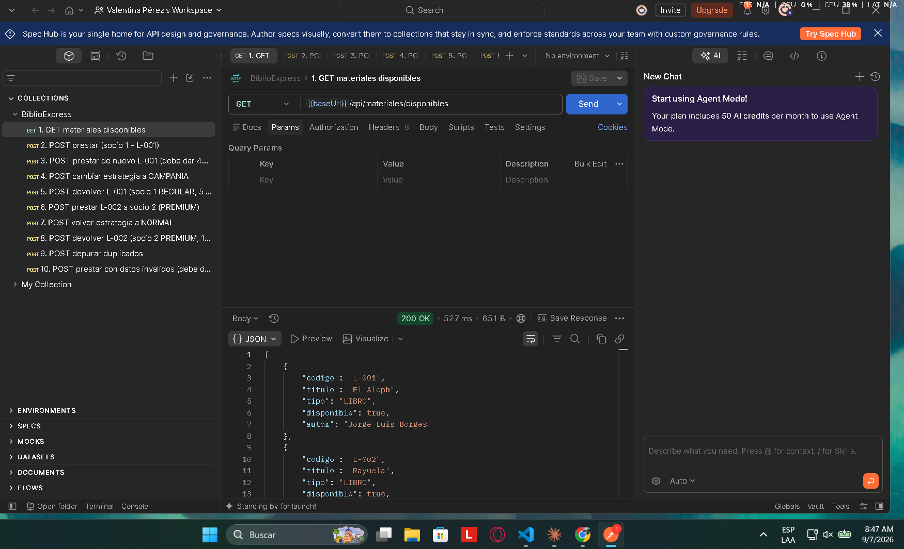
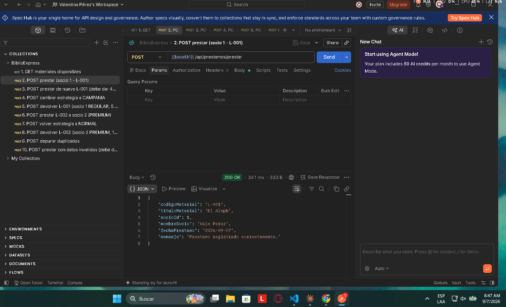
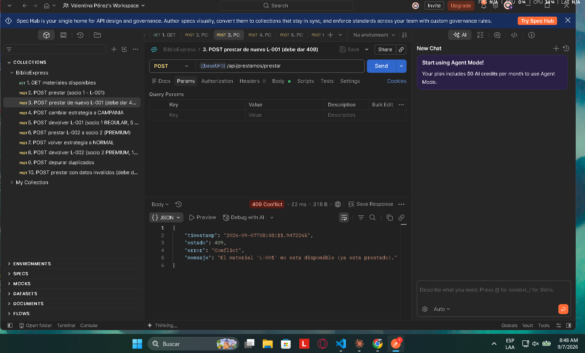
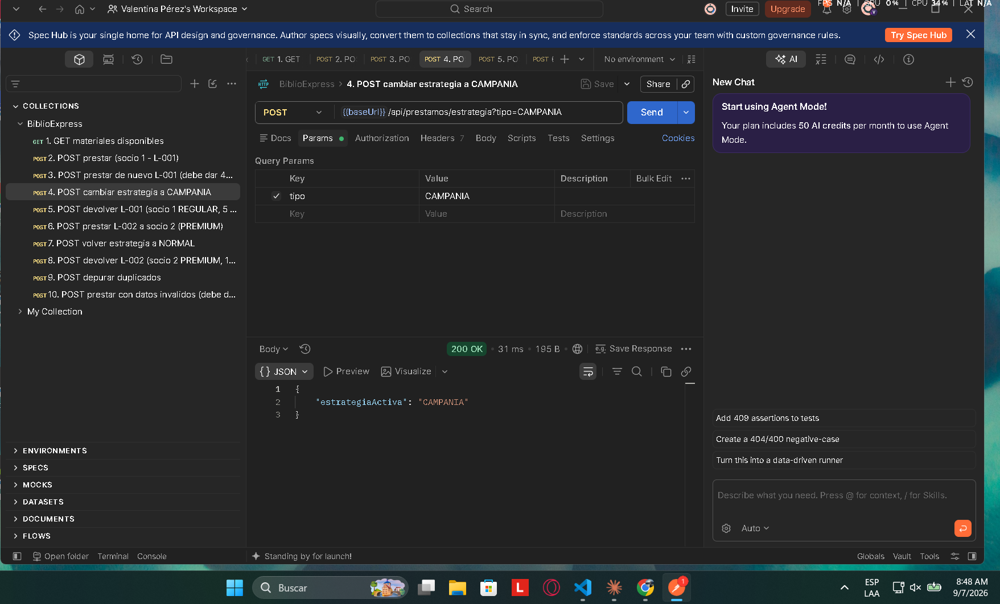
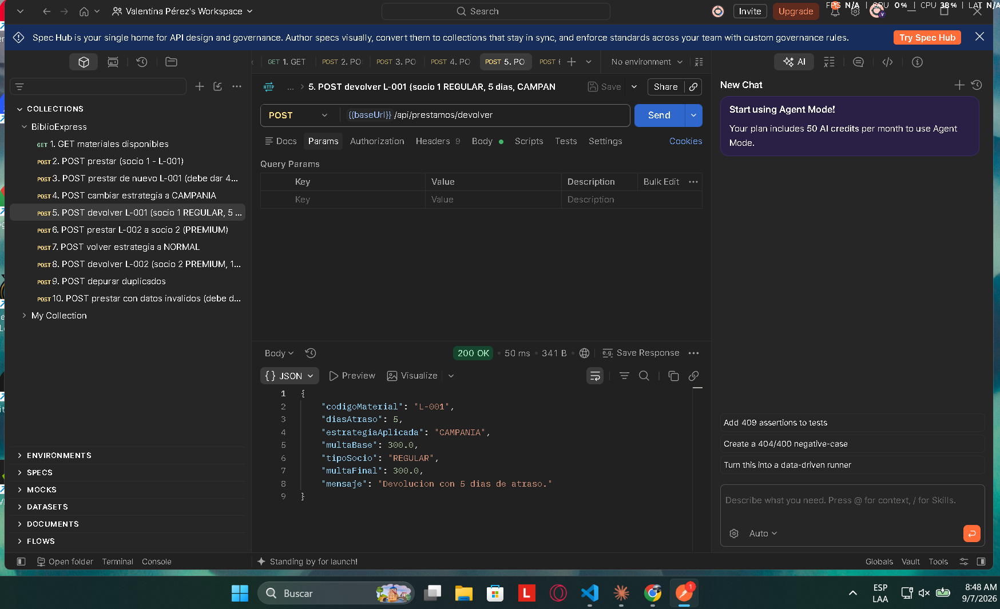
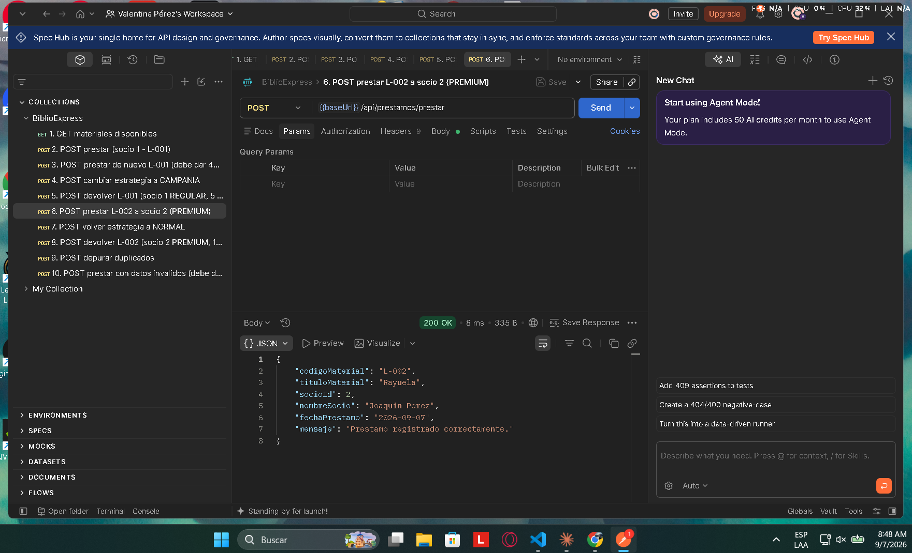
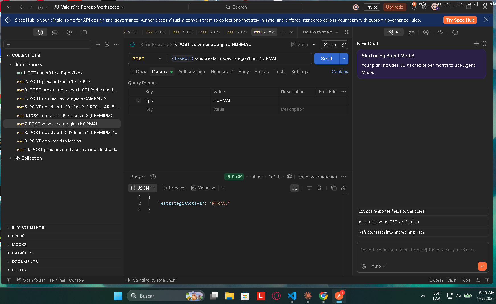
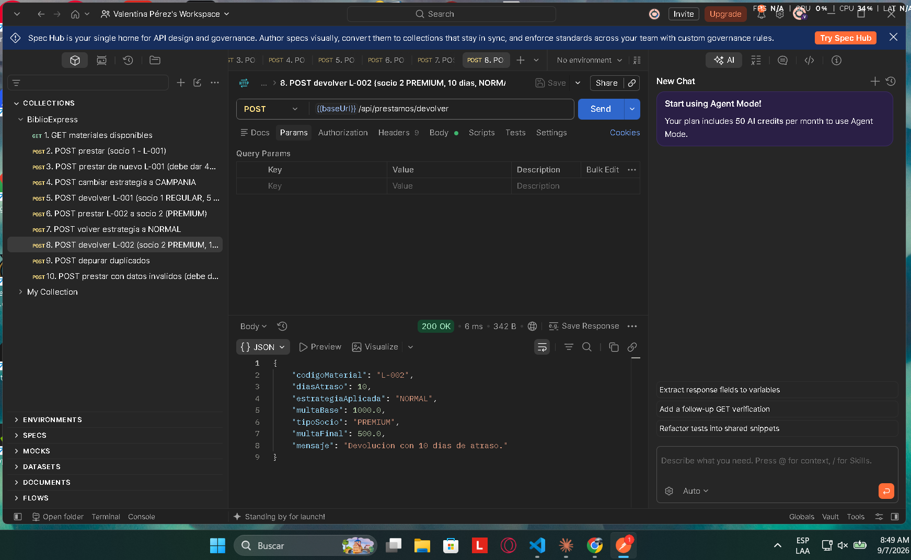
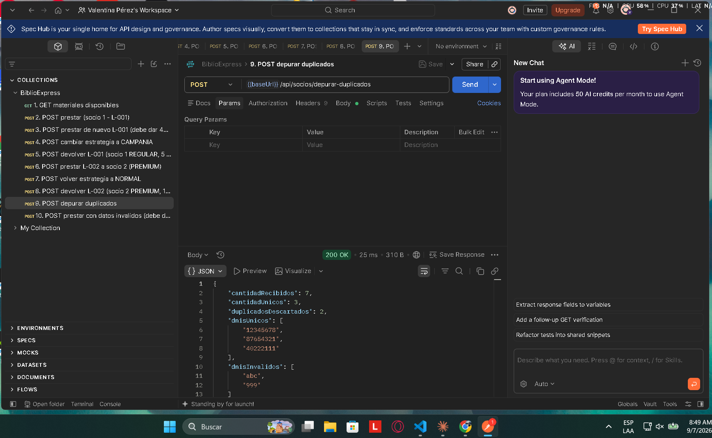
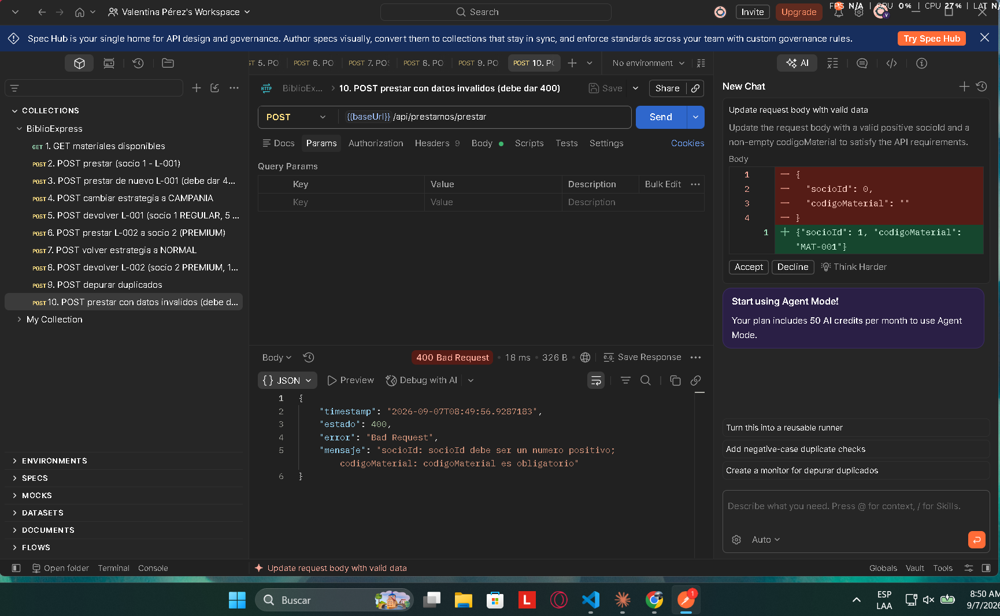

# EVIDENCIAS - BiblioExpress

Pruebas de los endpoints hechas con Postman (colección `BiblioExpress.postman_collection.json`).
API levantada con `mvn spring-boot:run` en `http://localhost:8080`.

---

## 1. GET /api/materiales/disponibles
Lista los 5 materiales, todos `disponible: true`. **200 OK**.

## 2. POST /api/prestamos/prestar
Body: `{ "socioId": 1, "codigoMaterial": "L-001" }` → **200 OK**, "Prestamo registrado correctamente."

## 3. POST /api/prestamos/prestar (material ya prestado)
Body: `{ "socioId": 2, "codigoMaterial": "L-001" }` → **409 Conflict**, "El material 'L-001' no esta disponible (ya esta prestado)."

## 4. POST /api/prestamos/estrategia?tipo=CAMPANIA
**200 OK**, `{ "estrategiaActiva": "CAMPANIA" }`

## 5. POST /api/prestamos/devolver (socio REGULAR, estrategia CAMPANIA)
Body: `{ "socioId": 1, "codigoMaterial": "L-001", "diasAtraso": 5 }`
→ `multaBase: 300` (5 × 60), `tipoSocio: REGULAR`, `multaFinal: 300`.

## 6. POST /api/prestamos/prestar (socio PREMIUM)
Body: `{ "socioId": 2, "codigoMaterial": "L-002" }` → **200 OK**, préstamo a "Joaquin Perez".

## 7. POST /api/prestamos/estrategia?tipo=NORMAL
**200 OK**, `{ "estrategiaActiva": "NORMAL" }`

## 8. POST /api/prestamos/devolver (socio PREMIUM, estrategia NORMAL)
Body: `{ "socioId": 2, "codigoMaterial": "L-002", "diasAtraso": 10 }`
→ `multaBase: 1000` (10 × 100), `tipoSocio: PREMIUM`, `multaFinal: 500` (50 % de descuento).

## 9. POST /api/socios/depurar-duplicados
Body: `{ "dnis": ["12345678","12345678","87654321","abc","999","40222111","87654321"] }`
→ `cantidadRecibidos: 7`, `cantidadUnicos: 3`, `duplicadosDescartados: 2`, `dnisInvalidos: ["abc","999"]`.

## 10. POST /api/prestamos/prestar con datos inválidos
Body: `{ "socioId": 0, "codigoMaterial": "" }` → **400 Bad Request** con el detalle de los campos.

